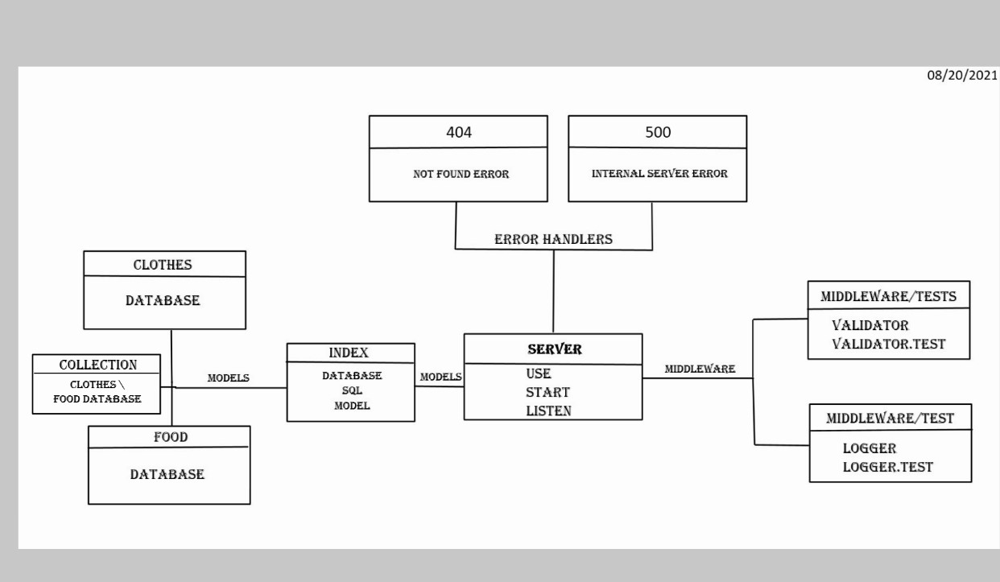

# server-api

## uml :

##### Author : Ibrahim Khdairat 

* [GitHub Repo Link](https://github.com/MAMOUN-kamal-alshisani/server-api)

* [Pull Request](https://github.com/MAMOUN-kamal-alshisani/server-api/pull/2)

* [Heroku Link](https://basic-api-server123.herokuapp.com/) 

##### Setup
.envre quirements
  * PORT - Port Number

**Running the app**
* `npm start`
* Endpoints:
* ##### 1 -  `/status`

***Returns Object***

>[{
"id": 1,
"foodName": "pasta",
"recipe": "eggs,water,flour",
"createdAt": "2021-08-18T19:11:58.367Z",
"updatedAt": "2021-08-18T19:11:58.367Z"
},
{
"id": 2,
"foodName": "shawrma",
"recipe": "chicken",
"createdAt": "",
"updatedAt": ""
}]

* ##### 3 -  clothes  

Returns Object as example : 

>{
  "id": 1,
  "clothesName": "jacket",
  "color":balck
  "createdAt": "",
  "updatedAt": ""

}

**Tests**
***Unit Tests: npm run test***
